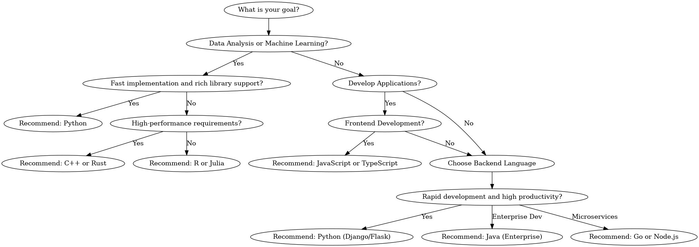

# Programming Language Selection Flowchart

This repository contains a flowchart designed to help users select the most suitable programming language based on their specific goals and requirements.

## Flowchart Overview

The flowchart assists in deciding the appropriate programming language based on the following considerations:
- Whether the goal is **data analysis/machine learning** or **application development**.
- Specific requirements for:
  - **Performance optimization**
  - **Library/tool support**
  - **Frontend or backend development**



## Steps to Use the Flowchart

1. Start at the **Starting Point**: Determine your primary goal:
   - Data analysis or machine learning?
   - Developing applications?

2. Follow the flowchart based on your answers:
   - For **data analysis or machine learning**, choose based on:
     - Need for performance or library support.
   - For **application development**, decide between frontend or backend languages.

3. Use the recommended language based on the specific decision points:
   - Data-focused languages: **Python**, **R**, **Julia**.
   - Application-focused languages: **JavaScript**, **TypeScript**, **Go**, **Java**, **Node.js**.

## Example Decision Scenarios

### Scenario 1: Data Analysis
- **Goal**: Perform data analysis with extensive library support.
- **Decision**: Choose **Python** due to its comprehensive libraries like Pandas, NumPy, and SciKit-Learn.

### Scenario 2: High-Performance Backend
- **Goal**: Build a backend with high-performance requirements.
- **Decision**: Choose **C++** or **Rust** for their speed and system-level capabilities.

### Scenario 3: Frontend Development
- **Goal**: Create a modern web application interface.
- **Decision**: Choose **JavaScript** or **TypeScript** for their widespread adoption and robust frontend frameworks like React or Angular.

## Repository Contents

- `Programming_Language_Selection_Flowchart.png`: Visual representation of the decision tree.
- `README.md`: This documentation.

## Contributing

Contributions to improve this flowchart or add more decision paths are welcome! Please follow these steps:

1. Fork the repository.
2. Create a new branch:
   ```bash
   git checkout -b feature/your-feature-name
